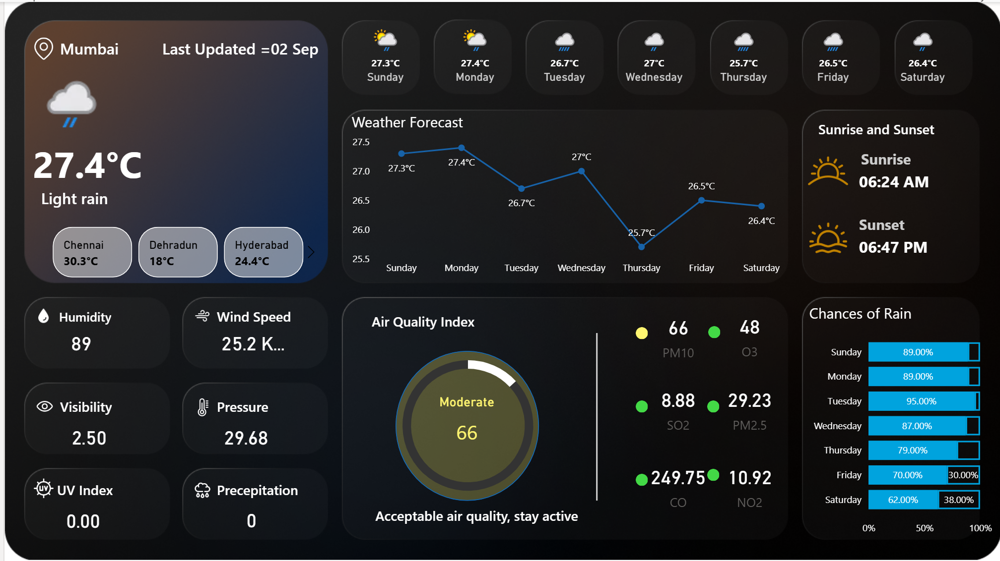

# 🧭 Expedition Log: Weather Forecast Analysis

---

### **Log Entry: Stardate 09.17.2025**

**Mission:** To venture beyond the dense fog of raw environmental data and emerge with a tool that provides simple, actionable clarity for daily decision-making. This log documents the strategy, challenges, and discoveries made along the way.

---

## 📍 **The Destination: A Clear View**
This is the artifact recovered from the expedition—a "Decision Cockpit" designed not just to display information, but to guide action.

---

## 🗺️ **The Mission Briefing: Identifying the True North**

My initial reconnaissance revealed that we are drowning in data, but starved for wisdom. The mission wasn't to build another weather app. It was to answer the fundamental human questions that data should serve:

> *`"Is today a good day for an outdoor run?"`*
>
> *`"Which day this weekend is better for a family picnic?"`*
>
> *`"Should I be worried about air quality on my commute?"`*

**Hypothesis:** The value isn't in the data point itself, but in its translation into a direct, personal answer.

---

## 🐛 **A Critical Discovery: When a Bug Becomes a Compass**

Early in the journey, I encountered a significant anomaly: the forecast was displaying days alphabetically (`Friday`, `Monday`, `Saturday`). My initial log entry marked this as a "bug."

  
<strong>Click to expand my thought process on this "bug"...</strong>

  
  > A purely technical mindset would patch this and move on. But as a product manager, I saw it as a profound discovery. It revealed a core conflict between how machines process information and how humans perceive time.
  >
  > My solution—engineering a `DayOfWeekSort` column—was more than a fix. It was a conscious decision to build the product's logic around a **human-centric paradigm**. The product had to learn to think like a person, not a database. This anomaly became my compass, constantly reminding me to prioritize the user's mental model over the machine's.

---

## 🛠️ **My Explorer's Toolkit: Frameworks for Decision-Making**

Every feature was a deliberate choice, guided by established product management frameworks.

  
<strong>Click to see the analytical frameworks I used...</strong>

| Feature Element         | Framework Deployed            | Mission Rationale                                                                                                                                                             |
| ------------------------- | --------------------------------------- | ------------------------------------------------------------------------------------------------------------------------------------------------------------------------------- |
| **Air Quality Index Gauge** | `Data-to-Insight Translation`     | A number like "66" is abstract. I translated it into a universal language of color (Green/Yellow/Red) and a simple text command ("Stay active"), transforming data into a direct order. |
| **City Selection Toggles** | `Jobs-to-be-Done (JTBD)`                | The user's "job" is simple: get relevant info, fast. These toggles serve that one job perfectly, with zero friction.                       |
| **7-Day Forecast Chart** | `Trend vs. Point-in-Time`      | A user plans their life as a story, not a single moment. A line chart tells the story of the week, allowing them to see the narrative and plan ahead.                 |

---

## ✨ **Charting Future Expeditions: Potential New Worlds**

This initial expedition was a success, but it revealed even more territory to explore. Here are three potential future missions:

- **Mission "Hyperion":** The Hyper-Personalization Quest.
  - **Objective:** Integrate with calendars and health data to create a proactive "Smart Activity Scheduler."
- **Mission "Venture":** The B2B Frontier.
  - **Objective:** Repackage the insight engine as a commercial API for small businesses (e.g., restaurants with patios) to predict foot traffic.
- **Mission "Agora":** The Community-Sourced Data World.
  - **Objective:** Build a feature for users to report real-time conditions, using crowdsourced data to create a self-improving, hyper-local model.

---

## 🧭 **My Guiding Principles: The Product Manager's Creed**

This journey reinforced my core beliefs about product creation:

1.  **Empathy is the Ultimate Compass:** Always navigate by the user's needs and mental models.
2.  **Data is the Terrain, Insight is the Path:** Data tells you where you are; insight tells you where to go.
3.  **Simplicity is the Destination:** The goal of complex work is to create an output that is effortlessly simple for the user.

---

## 🏆 **Defining Treasure: What Success Looks Like**

An expedition is only successful if you know what you're looking for. For this product, success is not just usage—it's impact.

- **The Ultimate Treasure (North Star Metric):** `Daily Active Decisions (DAD)`
- **Key Artifacts (Primary Metrics):**
  - **`Time to Insight (TTI)`:** Is it under 3 seconds?
  - **`Data-to-Action Ratio`:** Are users making plans?
  - **`Retention`:** Are they returning for guidance tomorrow?

---

## 🔭 **The Horizon Goal**

The ultimate vision is not to build better dashboards. It is to pioneer **ambient, predictive, and personalized insight.** To create a future where your environment doesn't just happen *to* you, but where you are intelligently guided *through* it.

---
*Logbook closed. This expedition was led and documented by **Tanuj Upadhyay**.*
